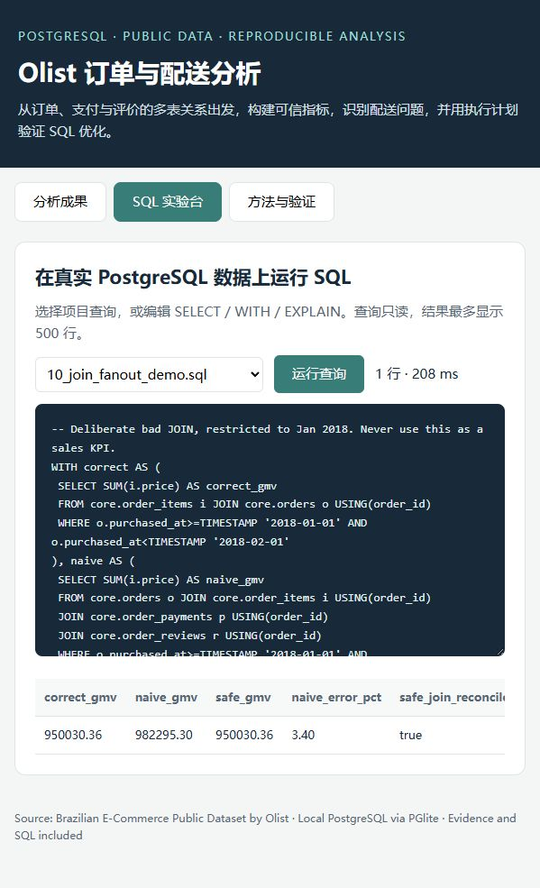

# Olist E-commerce Order & Delivery Analytics with SQL

A PostgreSQL portfolio project answering: **where should an e-commerce operations team investigate delivery problems, and can its metrics be trusted?**

The project uses the public Brazilian E-Commerce dataset by Olist. It preserves source data, models relational keys, builds an order-level analytical mart, answers ten business questions, and verifies totals before presenting recommendations.

## Evidence at a glance

- 99,441 orders; eight imported CSV tables, including 112,650 item rows and 103,886 payment rows.
- All SQL executed on **PostgreSQL 18.3 via PGlite 0.5.8**, a local WASM PostgreSQL engine. Native PostgreSQL import scripts are supplied but have not been executed on a separate server.
- 42 automated checks passed: file hashes, import counts, core counts, order grain, monetary reconciliation, review selection coverage, cohort bounds and query-result equivalence.
- Delivered item GMV across the full source: **BRL 13,221,498.11**. This is merchandise value, not Olist company revenue or profit.
- Main analysis window (January 2017–August 2018): low ratings occur in **62.42%** of reviewed late orders versus **9.25%** of reviewed on-time orders. This is an association, not a causal estimate.
- In January 2018, a naive item/payment/review JOIN produces a **3.40%** GMV error; pre-aggregation exactly reconciles to item prices.
- Query plans and three warm-run measurements per stage are saved in `results/query_optimization.json`.

## Run locally on Windows

Node.js 20+ is required. On the first run, the bootstrap downloads and verifies the pinned dataset and local runtime. Subsequent builds can run offline with those files present.

```powershell
git clone https://github.com/WeixinChenDEV/olist-sql-analytics.git
cd .\olist-sql-analytics
.\run.ps1
.\run.ps1 -Query -SqlFile 'sql/analysis/05_lateness_and_reviews.sql'
.\run.ps1 -Serve
```

Open **http://127.0.0.1:8765** after the server starts. The SQL lab runs SELECT / WITH / EXPLAIN against the saved PostgreSQL snapshot in a read-only transaction. It displays up to 500 rows and uses a 10-second statement timeout. Ctrl+C stops the server.

`run.ps1` locates Node in PATH or in the Codex bundled runtime. On a new computer, `scripts/bootstrap.ps1` downloads the pinned Olist archive and PGlite package, validates their hashes, and extracts only expected source files. A changed upstream dataset causes verification to fail rather than silently changing results.

The offline report at `docs/index.html` also works without the server; SQL execution requires the server. After rebuilding:

```bash
node scripts/generate-report.mjs
```

Seven additional integration checks passed against the actual SQL lab: saved-data access, single-statement enforcement, read-only CTE protection, rollback/session recovery, session token, row cap and indexed-query equivalence. To rerun with the server running, use `node scripts/test_lab.mjs`. Evidence: `results/lab_validation.json`.

Alternatively, install the exact npm dependency with `npm ci`, then use `npm run build`, `npm run query -- sql/analysis/02_monthly_growth.sql` and `node scripts/serve.mjs`.

## Standard PostgreSQL / DBeaver

Create a **new empty database** named `olist`. From the project root, run:

```bash
psql -d olist -f sql/load_postgres.psql
psql -d olist -f sql/analysis/05_lateness_and_reviews.sql
```

The import uses client-side `\copy`, an atomic transaction and `ON_ERROR_STOP`. DBeaver can connect to that native PostgreSQL database and execute the ordinary `.sql` files. The lightweight PGlite snapshot is not a listening PostgreSQL service and cannot be connected to directly by DBeaver.

No existing schema is dropped. The import intentionally fails if its tables already exist. For native PostgreSQL, use UTF-8 and PostgreSQL 15+; native-server execution remains unverified in this workspace.

## Local SQL lab preview

The screenshot shows an actual query against the saved PostgreSQL database, comparing a naive multi-table join with reconciled order-grain totals.



## SQL questions

| File | Question | Skills demonstrated |
|---|---|---|
| `01_executive_kpis.sql` | What does the source contain, and what are the headline metrics? | FILTER, NULLIF, distinct counts, median |
| `02_monthly_growth.sql` | How do delivered GMV, order counts and lateness change by purchase month? | CTE, LAG, date bucketing |
| `03_category_ranking.sql` | Which categories contribute the most delivered GMV? | Multi-table JOIN, DENSE_RANK, share of total |
| `04_delivery_by_state.sql` | Which customer states have high lateness and long delivery tails? | HAVING, PERCENTILE_CONT, explicit denominators |
| `05_lateness_and_reviews.sql` | How do reviews differ between late and on-time orders? | CASE, conditional aggregation, null handling |
| `06_seller_watchlist.sql` | Which sufficiently large single-seller samples have the most late orders? | Grain control, thresholds, DENSE_RANK |
| `07_repeat_purchase.sql` | How many observed customers purchased more than once? | Customer-level aggregation, identity selection |
| `08_purchase_cohorts.sql` | What percentage purchased again in each observable subsequent month? | GENERATE_SERIES, interval arithmetic, zero-fill grid |
| `09_payment_reconciliation.sql` | Do recorded payments match item value plus freight? | Reconciliation, tolerance bands, status segmentation |
| `10_join_fanout_demo.sql` | What happens when several one-to-many tables are joined directly? | Fanout diagnosis, safe pre-aggregation |

## Structure

```text
data/manifest.json        source hashes, headers, row counts, import scope
data/raw/                original CSVs and downloaded archive (ignored by Git)
data/local-db.tar.gz      saved local PostgreSQL snapshot (ignored by Git)
sql/01_raw.sql           text staging tables
sql/02_model.sql         typed relational model and analytical marts
sql/03_quality_audit.sql  source anomalies and missing data
sql/04_validate.sql      SQL invariants
sql/05_indexes.sql       measured index and supporting indexes
sql/load_postgres.psql   native PostgreSQL import
sql/analysis/            ten runnable business queries
scripts/                 IO, orchestration, local server and report generation
results/                 committed CSV/JSON query results and evidence
docs/                    report, dictionary, model, learning and interview notes
```

## Decisions that protect correctness

1. Aggregate items and payments separately to order grain before joining. Pick one latest review with `ROW_NUMBER`; do not pretend `review_id` is unique.
2. Use `customer_unique_id` for customer analysis. `customer_id` identifies an order-linked customer record.
3. Treat BRL amounts as exact PostgreSQL NUMERIC. Keep item GMV, freight and payments separate.
4. Evaluate lateness only for delivered orders with valid delivery/estimate dates. Compare calendar dates, because estimates are date values at midnight.
5. Use the January 2017–August 2018 window for most business comparisons. It excludes sparse boundary months; it does not prove that the dataset contains every order in the business.
6. Keep source anomalies visible. Exclude them only from metrics that require a valid value, with explicit denominators.

Read `docs/methodology.md`, `docs/business_report.md` and `docs/学习与面试说明.md` for details.

## Attribution and scope

Data: [Brazilian E-Commerce Public Dataset by Olist](https://www.kaggle.com/datasets/olistbr/brazilian-ecommerce), Olist, historical orders from 2016–2018. See `DATA_LICENSE.md` before reuse. The geolocation CSV is preserved and hashed, but excluded from the analytical database because this project uses state-level geography.

Runtime: [PGlite](https://pglite.dev/docs/about), Apache-2.0. Dependencies remain under their original licenses. Raw data, dependency archives and database dumps are excluded from the publication bundle.

This is an independent public-data portfolio study. No analysis was deployed at Olist, and no business uplift is claimed. Resume wording is provided as a draft to use after understanding and being able to explain the work.
