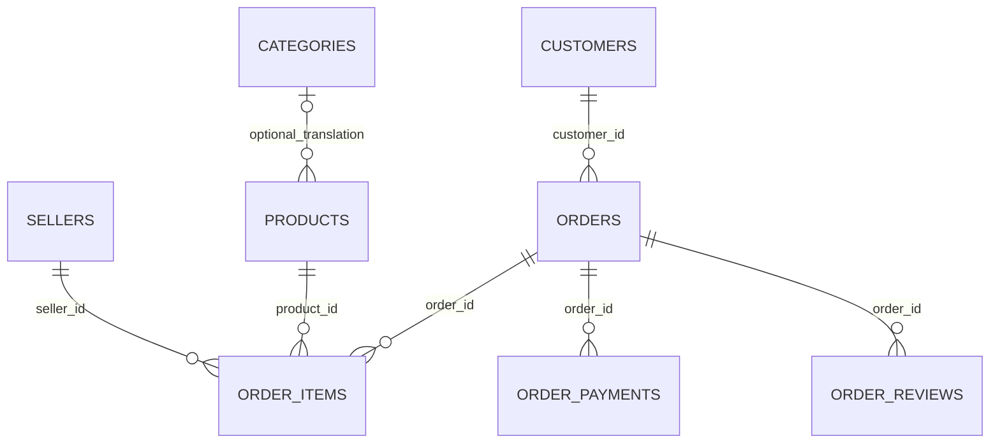

# Data dictionary and entity relationships

## Core tables

| Table | Grain / key | Important columns | Source rows |
|---|---|---|---:|
| customers | One order-linked customer record / customer_id | customer_unique_id (cross-order identity), state, city, zip_prefix | 99,441 |
| orders | One order / order_id | customer_id FK, status, purchased_at, approved_at, carrier_at, delivered_at, estimated_at | 99,441 |
| order_items | One item sequence per order / (order_id, item_number) | product_id FK, seller_id FK, shipping_limit_at, price, freight | 112,650 |
| order_payments | One payment sequence per order / (order_id, payment_number) | payment_type, installments, payment_value | 103,886 |
| order_reviews | One CSV record / source_row | review_id (nonunique), order_id FK, score, title, message, created_at, answered_at | 99,224 |
| products | One product / product_id | category_pt, weight_g, dimensions, source description metadata | 32,951 |
| sellers | One seller / seller_id | state, city, zip_prefix | 3,095 |
| categories | One translation / category_pt | category_en | 71 |

ZIP prefixes remain text to preserve leading zeros. IDs remain text and must not be cast to numeric. Product columns with original misspellings (`lenght`) are mapped to `name_length` and `description_length` in core. Money is NUMERIC(14,2). Source timestamps have no timezone declaration.

Products may have a missing category or a category without an English translation. The translation relation is a logical optional join rather than a forced FK. No product is dropped for missing translation.

## Model

## Analytical tables

`mart.order_fact`: all order columns, customer_unique_id, customer_state, item_count, seller_count, item_gmv, freight, payment_count, payment_total, selected review_score, nullable is_late and delivery_days. Exactly 99,441 rows in the pinned snapshot.

`mart.latest_review`: one selected review per reviewed order; all raw reviews remain in core.

`mart.seller_order_fact`: seller_id + order_id, seller-specific item_gmv, shared purchase/status/lateness/review attributes and seller_count. Use single-seller filtering when evaluating seller-associated delivery outcomes.

`mart.analysis_orders`: fixed-window view over order_fact, purchases from January 2017 through August 2018.

The excluded geolocation CSV contains 1,000,163 records and repeated ZIP prefixes. It is retained with its hash but not joined, preventing accidental fanout from geographic records.
