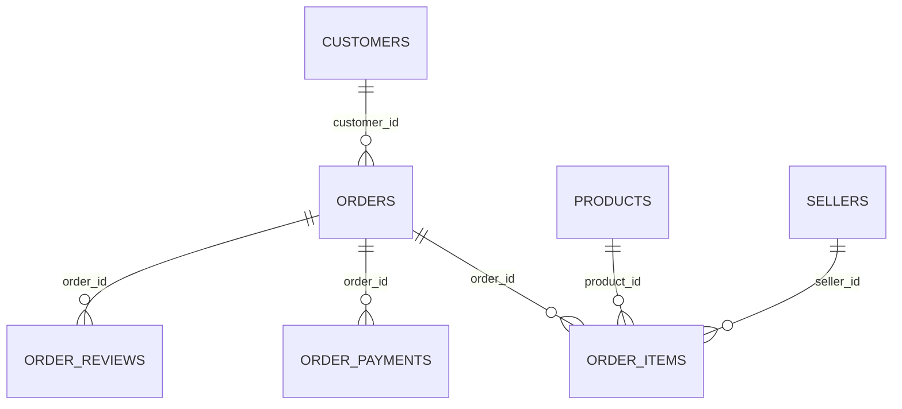

# Data and query notes

Source: [Olist on Kaggle](https://www.kaggle.com/datasets/olistbr/brazilian-ecommerce).

## Tables

| Table | Rows | What one row represents |
|---|---:|---|
| customers | 99,441 | An order-linked customer record |
| orders | 99,441 | An order |
| order_items | 112,650 | An item sequence within an order |
| order_payments | 103,886 | A payment sequence within an order |
| order_reviews | 99,224 | A review record in the CSV |
| products | 32,951 | A product |
| sellers | 3,095 | A seller |
| categories | 71 | A Portuguese-to-English category translation |

The source includes a geolocation file, but this analysis only uses states. Its ZIP codes have multiple records, so it is not joined to the orders.

## Setup

`tables.sql` loads CSV values as text into `raw`. `cleaning.sql` converts the types in `core` and creates summary views in `mart`. Blank fields become NULL. Money uses NUMERIC rather than FLOAT. ZIP prefixes are text so leading zeros are kept.

The source timestamps do not specify a time zone, so they are kept as timestamps without a time zone. The summary views are materialized; changes to the source tables need a refresh or a rebuild.

## Calculation choices

- Delivered sales: sum of item prices for orders with status `delivered`, excluding freight.
- Late delivery: actual delivery day is after the estimated day. The estimate is stored at midnight, so comparing full timestamps would incorrectly mark some same-day deliveries as late.
- Late-rate denominator: delivered orders with valid purchase/delivery times and an estimated delivery date.
- Low score: 1 or 2 out of 5, divided by orders that have a selected review.
- Latest review: `ROW_NUMBER` by answer time, creation time, review ID, then CSV row number to break ties. All source reviews are still stored.
- Repeat customer: at least two delivered orders in the selected period, grouped by `customer_unique_id`.
- Cohort: first observed delivered purchase month. Only compare months with the same follow-up age. Unobserved future months are omitted rather than set to zero.

The main period excludes the sparse first and last months. It does not guarantee that the source contains every order from the business. Overview and payment checks use the full dataset; the join example uses January 2018.

## Checks

`check_data.sql` counts missing values, repeated reviews, and unusual dates. For example, 547 orders have multiple review records and 2,961 have multiple payments.

`check_totals.sql` checks that there is one summary row per order and that item prices, freight, and payments match their own source-table totals. Items plus freight are not forced to equal payments: 249 orders differ by more than BRL 1.

The helper script also checks source hashes, row counts, review coverage, cohort bounds, and equal query results before saving the database. The check results are saved in `results/checks.json`.
